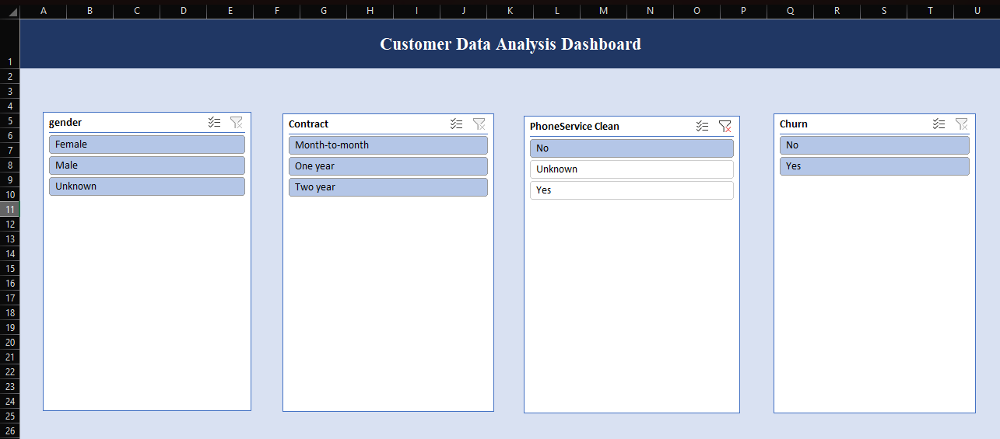
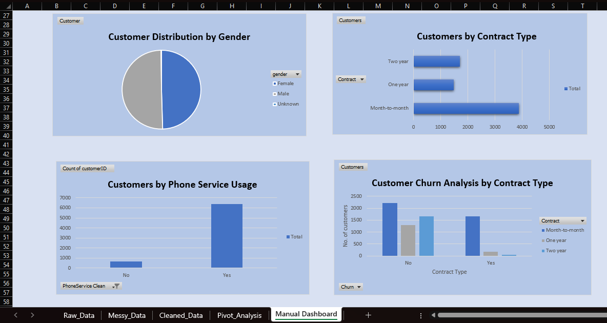
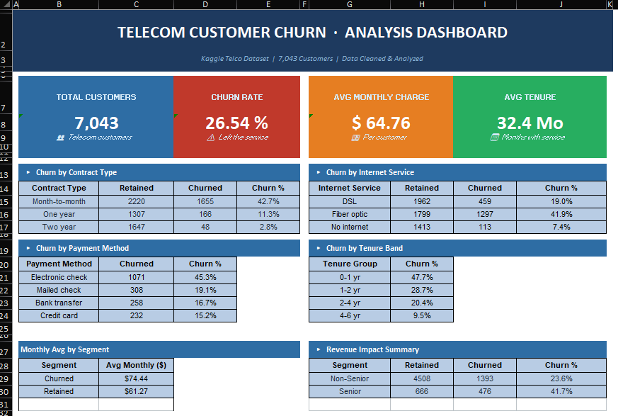
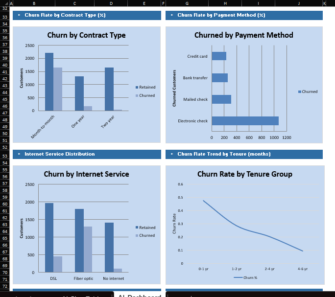
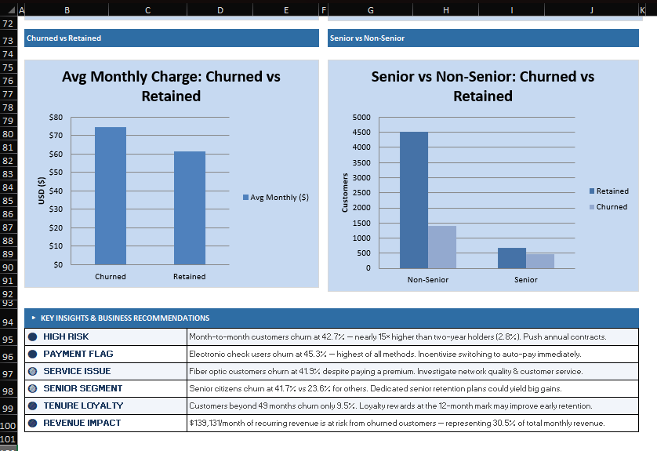

# 📊 Telecom Customer Churn Analysis (Excel + AI)

##  Overview

This project demonstrates data cleaning, analysis, and dashboard creation using Excel and AI tools.

##  Problem Statement

The goal of this project is to analyze customer data, clean inconsistencies, and identify patterns in customer churn and service usage.

##  Dataset

This project uses the **Telecom Churn Dataset** sourced from Kaggle.
🔗 Dataset Link: https://www.kaggle.com/datasets/blastchar/telco-customer-churn

##  Manual Work

* Simulated real-world messy data by introducing missing values and inconsistencies
* Cleaned dataset using Excel functions (TRIM, PROPER, IF, VALUE)
* Handled missing values and standardized text formats
* Created pivot tables for analysis
* Built interactive dashboard using charts and slicers

## 🔹 AI Dashboard

* Used AI tools to generate dashboard
* Compared manual vs automated insights

##  Key Insights

- Customers with month-to-month contracts show highest churn (~X%)
- Customers using electronic payment methods have higher churn rate
- Long-term contract customers are more stable and retained

##  Files

* `1_Data_Cleaning_Manual.xlsx`
* `2_Dashboard_AI.xlsx`

##  Tools Used

* Microsoft Excel
* AI-assisted Excel tools

## 📊 Manual Dashboard

## 🤖 AI Dashboard

##  Learning Outcome

This project helped me understand real-world data cleaning, dashboard creation, and use of AI tools in analytics.
